# Air Lab Pico Edition

A standalone indoor air-quality monitor on a Raspberry Pi Pico 2 that shows live
readings and history graphs on an OLED and logs everything to flash.


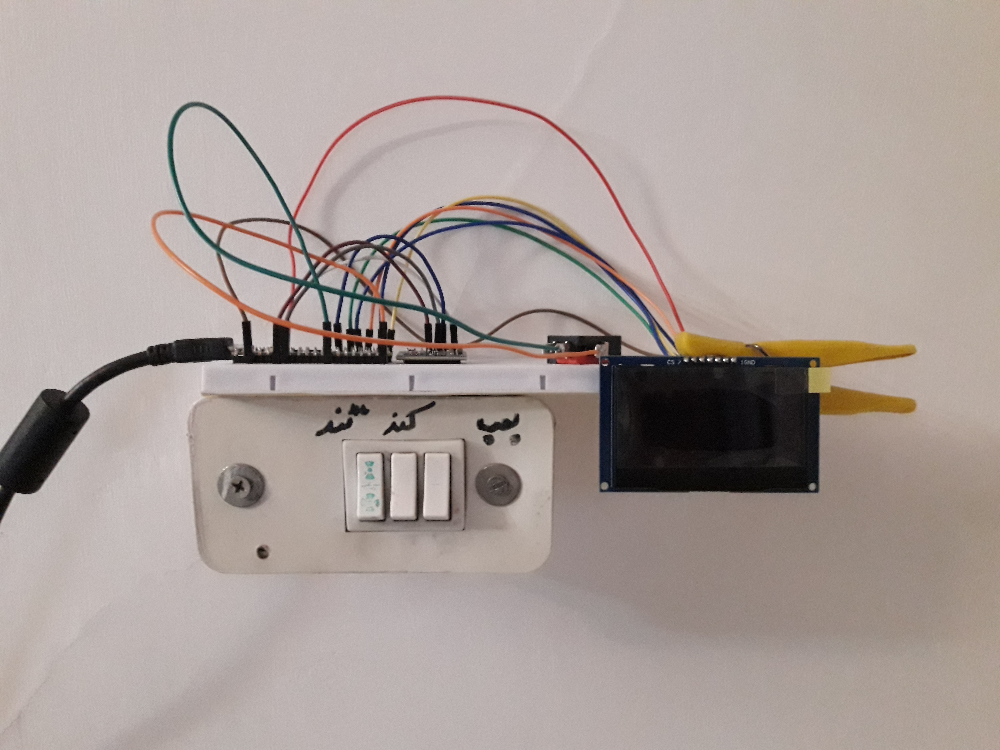

## Contents

[Features](#features) - [Screenshots](#screenshots) - [Hardware and parts](#hardware-and-parts) -
[Wiring](#wiring) - [Installation](#installation) - [Configuration](#configuration) -
[How it works](#how-it-works) - [Log file format](#log-file-format) - [Results](#results) -
[Known limitations](#known-limitations) - [Troubleshooting](#troubleshooting) -
[Repository layout](#repository-layout) - [Third-party code](#third-party-code) -
[References](#references) - [Development notes](#development-notes) -
[License](#license) - [Author](#author)

## Features

- **Two-tier storage.** Five synchronised RAM circular buffers hold recent
  samples for the graphs; the same samples are flushed to binary files in the
  Pico's flash filesystem.
- **Seven display pages.** A live dashboard, one history graph per metric
  (temperature, humidity, AQI, eCO2, TVOC) and a system page, cycled with a
  single push button.
- **Compact log records.** 18 bytes per sample, with `65535` as the sentinel for
  a gas reading that was not valid.
- **Warm-up handling.** While the ENS160 reports warm-up or invalid data, gas
  values are stored as NaN in RAM, written as `65535` to flash, and shown as
  `WARMUP` on the dashboard; graph pages skip those samples.
- **Screen saver.** The OLED blanks after a configurable idle time to reduce
  burn-in; the first button press only wakes it, without changing page.
- **Hardware watchdog.** A watchdog timer is started at boot and fed on every
  loop iteration.
- **Rolling log files.** Files are named `airlab_NNN.bin`, rotated when they
  exceed a size computed at boot, and the oldest file is deleted only when the
  filesystem is more than 90 percent full.
- **RAM sized at boot.** Buffer capacity is computed from the free heap, and the
  arrays are pre-allocated before the hardware drivers are imported.
- **Non-blocking main loop.** The loop runs at about 20 Hz, so the button stays
  responsive while sampling and logging happen on their own timers.

## Screenshots

<table>
  <tr>
    <td width="33%">
      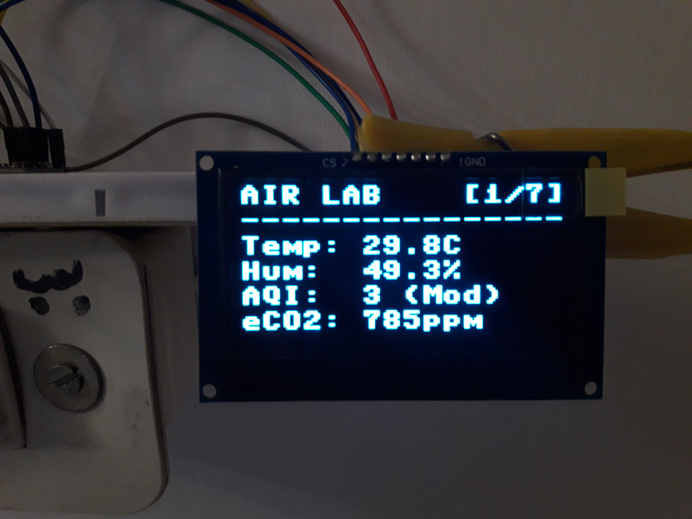<br>
      <b>Page 1</b> - live dashboard.
    </td>
    <td width="33%">
      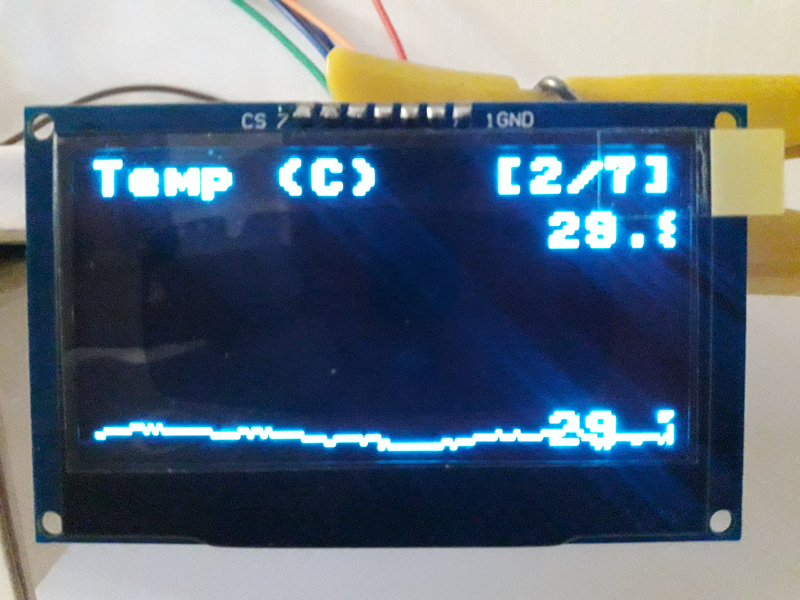<br>
      <b>Page 2</b> - temperature history.
    </td>
    <td width="33%">
      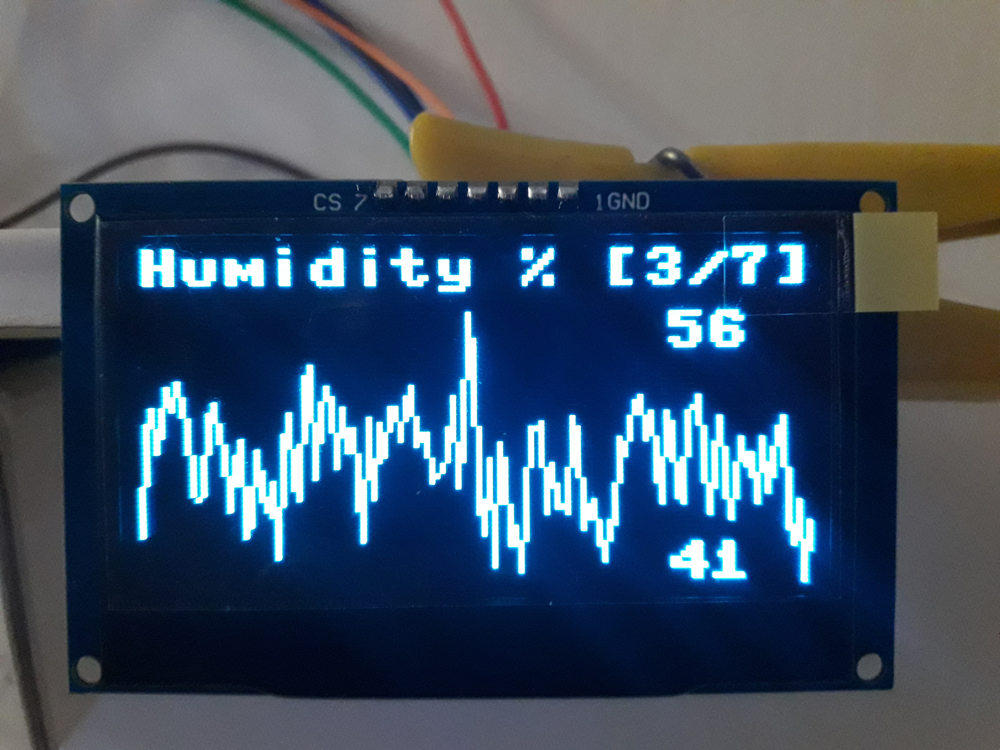<br>
      <b>Page 3</b> - humidity history.
    </td>
  </tr>
  <tr>
    <td>
      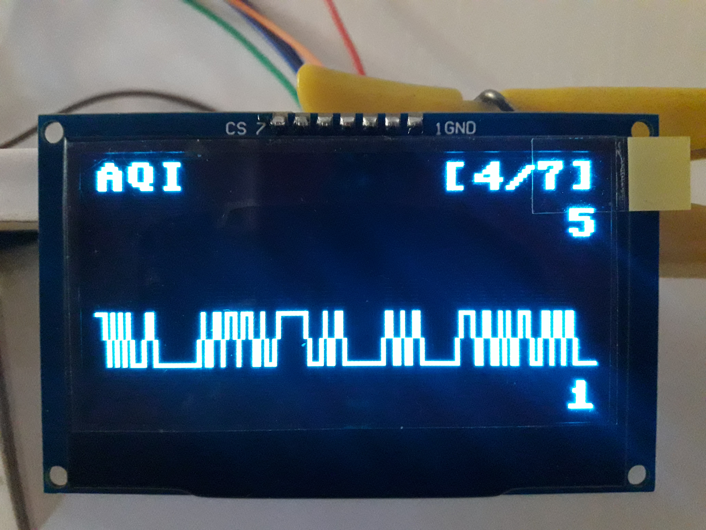<br>
      <b>Page 4</b> - AQI history (fixed 1-5 scale).
    </td>
    <td>
      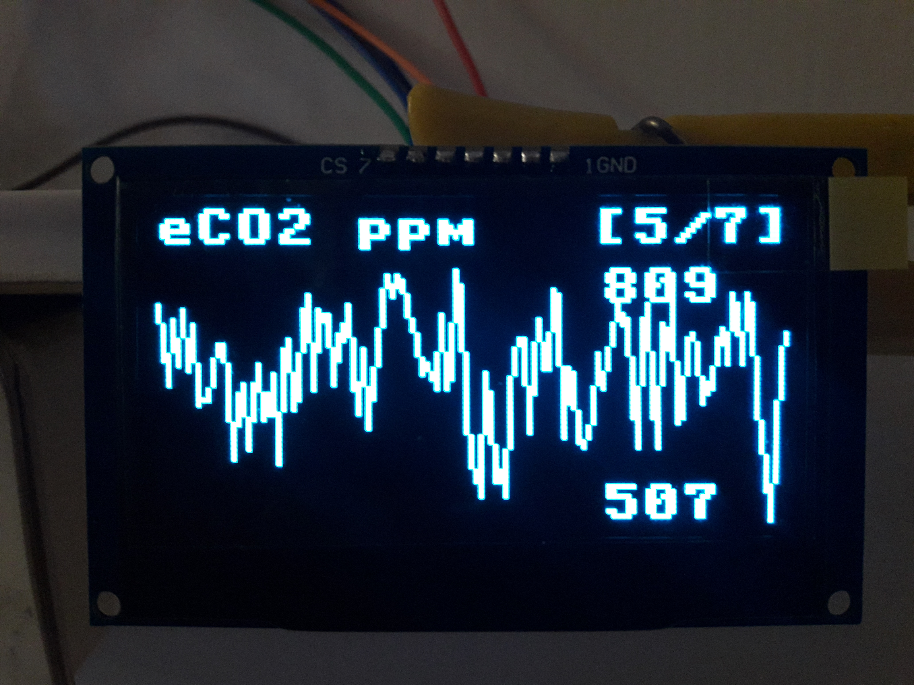<br>
      <b>Page 5</b> - eCO2 history.
    </td>
    <td>
      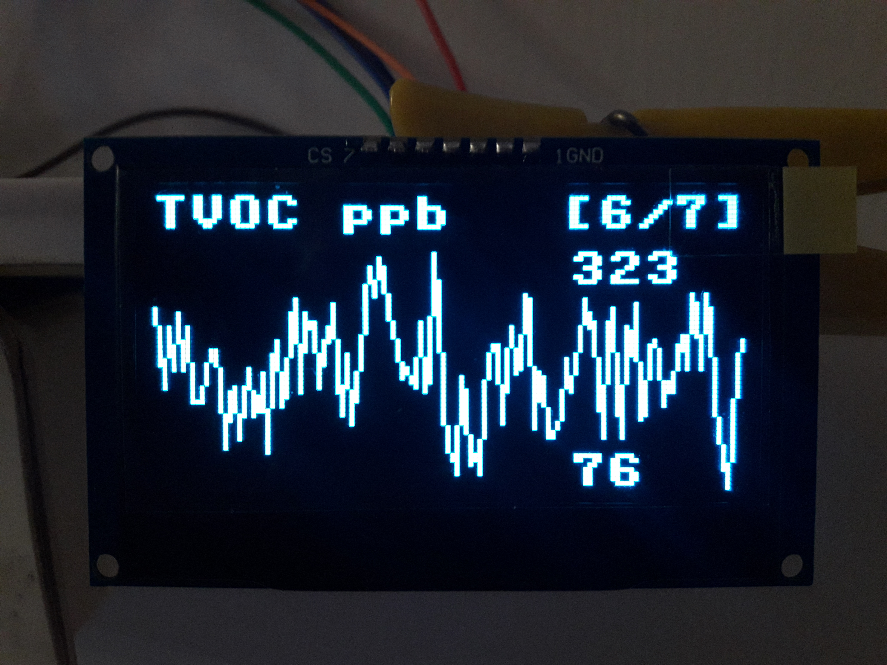<br>
      <b>Page 6</b> - TVOC history.
    </td>
  </tr>
  <tr>
    <td colspan="3">
      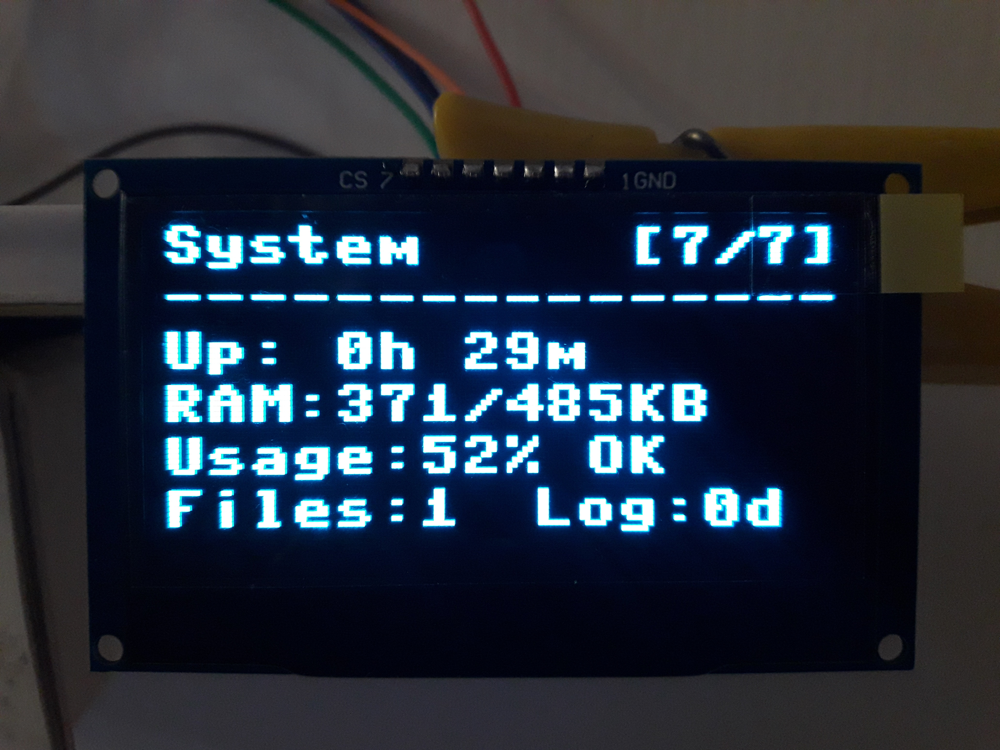<br>
      <b>Page 7</b> - system diagnostics: uptime, heap use, heap usage percentage
      with an OK/High/Full label, log file count and logged days.
    </td>
  </tr>
</table>

## Hardware and parts

| Part | Notes | Example source |
|---|---|---|
| Raspberry Pi Pico 2 (RP2350) | Powered over USB. Needs MicroPython v1.26.1 (2025-09-11) or later. | Any Raspberry Pi reseller |
| ENS160 + AHT21 breakout | Combined module, about 24x20 mm, I2C. ENS160 at `0x53`, AHT21 at `0x38`. 3.3 V supply, VIN accepts up to 5 V. | Product code SEN-16-042 at an Iranian online shop |
| 2.42-inch SSD1309 OLED | 128x64 monochrome, 7-pin SPI module. | Generic display module |
| Push button | Momentary, wired active low against the internal pull-up. | Any tactile or micro switch |
| Breadboard and jumper wires | The reference build is on a breadboard, mounted on a wall beside a light-switch plate. | - |
| USB cable | Data-capable cable for flashing and for the serial console. | - |

The sensor module's silkscreen carries VIN, 3V3, GND, SCL, SDA, ADO, CS and INT.
This project uses only power, ground, SCL and SDA; ADO, CS and INT are left
unconnected and no further claim is made about them.

The onboard LED on GP25 turns on while a sensor read is in progress, so a short
blink every sample interval is normal.

## Wiring

| Function | Pico 2 GPIO | Physical pin | Connects to |
|---|---|---|---|
| I2C0 SDA | GP4 | 6 | Sensor module SDA |
| I2C0 SCL | GP5 | 7 | Sensor module SCL |
| 3.3 V out | 3V3(OUT) | 36 | Sensor module 3V3/VIN pin and OLED VDD |
| Ground | GND | any GND pin (for example 38) | Sensor GND, OLED GND, one leg of the button |
| SPI0 SCK | GP18 | 24 | OLED SCK (CLK) |
| SPI0 TX (MOSI) | GP19 | 25 | OLED SDA (its data-in pin, MOSI) |
| OLED DC | GP16 | 21 | OLED DC |
| OLED RST | GP20 | 26 | OLED RST |
| OLED CS | GP17 | 22 | OLED CS |
| Button | GP15 | 20 | Other leg of the button goes to GND |
| Status LED | GP25 | onboard | none |

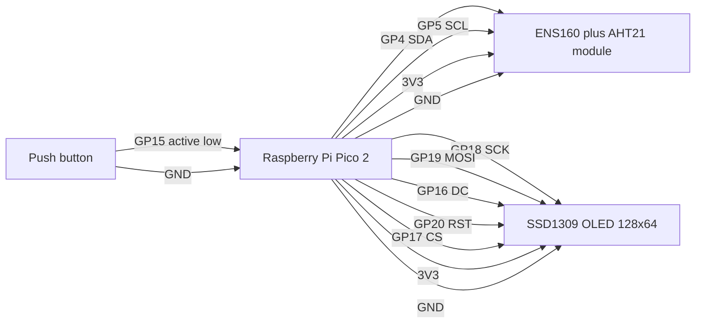

**Wiring notes**

- GPIO 16 is the default SPI0 RX pin, which is why `main.py` creates the SPI bus
  with `miso=None`; without it the DC line does not work.
- OLED pin labels vary between vendors, so match pins by function rather than by
  label.

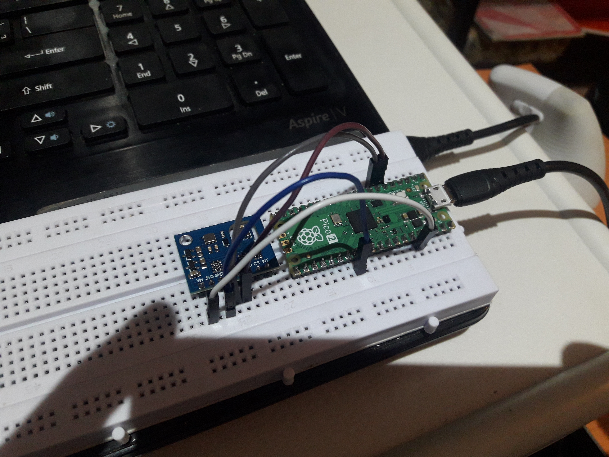

*Early prototype with only the Pico 2 and the sensor module.*

## Installation

### Prerequisites

- A Raspberry Pi Pico 2 and the parts above, wired as in the table.
- Python 3 on the host computer, for `pip` and `mpremote`.
- A data-capable USB cable.

### 1. Flash MicroPython

Download the current `RPI_PICO2` build (v1.26.1 or later) from
<https://micropython.org/download/RPI_PICO2/>, hold **BOOTSEL** while plugging
the board in, and copy the `.uf2` file to the `RP2350` drive that appears. The
board reboots into MicroPython on its own.

### 2. Install mpremote

```bash
pip install mpremote
```

### 3. Get the project files

```bash
git clone https://github.com/sana-hosseini/air-lab-pico.git
cd air-lab-pico
```

### 4. Copy the six files to the Pico's root

All six files in [`src/`](src/) go to the root of the Pico's filesystem. One
explicit `cp` per file, chained with `+`, so no shell wildcard expansion is
needed and the same command works on Windows:

```bash
mpremote cp src/main.py :main.py + cp src/buffers.py :buffers.py + cp src/datalogger.py :datalogger.py + cp src/ens160.py :ens160.py + cp src/aht21.py :aht21.py + cp src/ssd1309.py :ssd1309.py
```

Check the result and restart the board:

```bash
mpremote ls
mpremote reset
```

Thonny works as an alternative: connect to the Pico, then use *File - Save as -
Raspberry Pi Pico* for each of the six files, keeping the same names and placing
them in the root directory.

### 5. First boot

`main.py` runs automatically on power-up. Expect this sequence:

1. The serial console prints the banner, the RAM budget and the log file that
   will be used.
2. The OLED shows a splash screen for three seconds with the project name, the
   RAM and flash summary and the record size.
3. The dashboard appears. Temperature and humidity are live immediately;
   `AQI: WARMUP` and `eCO2: ---` are shown until the ENS160 reports valid data.
4. The ENS160 warms up for about three minutes **after every power-on**, and the
   graph pages for AQI, eCO2 and TVOC show `Warming up...` until at least two
   valid samples exist. The temperature and humidity graphs show `No data yet`
   until two samples have been taken.

The driver documentation also notes that a brand-new ENS160 should be powered
continuously for 24 hours once, so its calibration persists.

To watch the console output while the device runs:

```bash
mpremote repl
```

## Configuration

All user settings are constants at the top of [`src/main.py`](src/main.py).

| Constant | Default | Meaning |
|---|---|---|
| `DATA_SAMPLE_INTERVAL` | `30` | Seconds between sensor samples. The comment in the file suggests 10, 30, 60, 300 or 600. |
| `SCREEN_TIMEOUT` | `60` | Seconds without a button press before the OLED blanks. |
| `DISPLAY_REFRESH_MS` | `1000` | Display redraw interval in milliseconds (1 Hz). |
| `BUTTON_DEBOUNCE_MS` | `50` | Minimum milliseconds between accepted button presses. |
| `WATCHDOG_TIMEOUT_MS` | `16000` | Configured watchdog timeout in milliseconds (see [Known limitations](#known-limitations)). |
| `RAM_USAGE_TARGET` | `0.60` | Fraction of the RAM left after the fixed reserve that is spent on sample buffers. |

Changing `DATA_SAMPLE_INTERVAL` changes both how much history fits in RAM and
how large a log file becomes, because the file size target is expressed in days
of samples.

## How it works

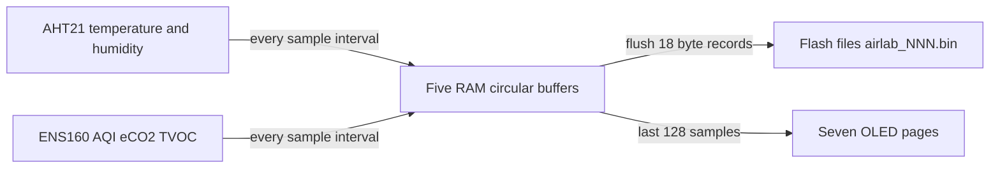

### Sampling and the main loop

The main loop targets a 50 ms cycle, about 20 Hz. Every cycle it feeds the
watchdog, polls the button with a 50 ms debounce, and redraws the current page
at most once per second. Sampling is on its own timer: when
`DATA_SAMPLE_INTERVAL` has elapsed, the onboard LED turns on, the AHT21 is read,
the reading is pushed into the ENS160 as temperature and humidity compensation,
and `ens.update()` is called. If any of that raises, the error is printed,
temperature and humidity are recorded as `0.0` for that sample, and the gas
fields are recorded as invalid. A garbage collection pass runs every 600 loop
cycles, which is about every 30 seconds, and the GC threshold is re-armed
afterwards.

### RAM buffers

Buffer capacity is computed once at boot, before any hardware driver is
imported:

```text
AVAILABLE_RAM    = gc.mem_free() - (OVERHEAD_KB + MODULE_COMPILE_KB) * 1024
BUFFER_CAPACITY  = int(AVAILABLE_RAM * RAM_USAGE_TARGET / BYTES_PER_SAMPLE)
```

with `OVERHEAD_KB = 80`, `MODULE_COMPILE_KB = 30`, `RAM_USAGE_TARGET = 0.60` and
`BYTES_PER_SAMPLE = 40`. The 40 bytes are the RAM cost of one sample across all
five metrics: five buffers, each storing a 4-byte float plus a 4-byte timestamp.
This is the in-RAM cost and is unrelated to the 18-byte flash record.

If the computed capacity is below 1000 samples, boot stops with
`ValueError: Insufficient RAM`. The `DataLogger` is imported and constructed
before the display and sensor drivers so that the five large arrays are
allocated into a fresh heap; each array is filled through a generator
expression, which avoids building a temporary list.

Every buffer is a fixed-size circular buffer: `append()` overwrites the oldest
slot once the array is full, and `get_latest(n)` returns the most recent `n`
samples in chronological order.

### Flash logging

Two triggers are checked at the end of every logged sample, so both are
evaluated once per sample interval:

- **Time trigger:** at least 900 seconds (15 minutes) since the last flush.
- **Buffer trigger:** at least `buffer_capacity // 2` samples since the last
  flush.

A flush appends every sample since the previous flush to the current file in
binary append mode, then checks the file size with `os.stat()`. If the file is
larger than the size limit, the cleanup rule runs and a new file is started.

File names are `airlab_NNN.bin` in the filesystem root. The next number is the
highest existing number plus one, read from characters 8-10 of each matching
file name, so numbering continues across reboots.

The size limit is computed at boot as an **estimate**:

```text
max_file_size = min(86400 // sample_interval * 10 * 18, free_flash_bytes // 3)
```

that is, ten days of samples at 18 bytes each, capped at one third of the free
filesystem space so at least three files fit. At the default 30-second interval
the first term is `2880 * 10 * 18 = 518400` bytes, about 506 KB. If
`os.statvfs()` fails, the limit falls back to 512000 bytes.

Cleanup is deliberately conservative: only during rotation does the logger read
the filesystem statistics and compute `usage = 1 - free_blocks / total_blocks`.
Only if usage is above 0.90 is the lowest-numbered `airlab_NNN.bin` deleted.
Nothing is deleted while the filesystem has headroom.

If a write raises `OSError`, the logger prints `FLASH ERROR`, clears the flush
counters and keeps running in RAM-only mode, so the display stays alive.

### Display and button

There are seven pages in a fixed order:

| Page | Content |
|---|---|
| 1 | Dashboard: temperature, humidity, AQI with its rating word, eCO2 |
| 2 | Temperature graph, auto-scaled with a minimum span of 2.0 C |
| 3 | Humidity graph, auto-scaled with a minimum span of 2.0 percent |
| 4 | AQI graph on the fixed 1-5 scale |
| 5 | eCO2 graph, auto-scaled with a minimum span of 50 ppm |
| 6 | TVOC graph, auto-scaled with a minimum span of 50 ppb |
| 7 | System page: uptime, heap allocated and total, heap usage percentage with an OK/High/Full label, log file count and logged days |

Each graph page draws up to the last 128 samples, one pixel column per sample,
with the current maximum printed near the top right and the minimum near the
bottom right. The three gas pages drop invalid samples before drawing and
rescale the x axis over the samples that remain.

A press advances to the next page and wraps from 7 back to 1, and the page is
redrawn immediately for feedback. After `SCREEN_TIMEOUT` seconds without a
press, the OLED is cleared and stays dark. The first press after that only wakes
the screen and keeps the page it was on; the next press advances.

### ENS160 warm-up

The ENS160 driver reports a validity flag; value 1 means the roughly
three-minute warm-up after power-on. While the sensor is warming up or reports
no valid data, the AQI, eCO2 and TVOC buffers receive `float('nan')` instead of
a reading, the dashboard shows `WARMUP` and `---`, and the flush writes `65535`
into those fields.

## Log file format

Each record is exactly 18 bytes, written in this order:

| Field | Type | Bytes | Unit / notes |
|---|---|---|---|
| timestamp | uint32 | 4 | Seconds from `time.time()`, relative to boot |
| temperature | float32 | 4 | Degrees Celsius |
| humidity | float32 | 4 | Percent relative humidity |
| aqi | uint16 | 2 | UBA index 1-5; `65535` = no valid reading |
| eco2 | uint16 | 2 | ppm; `65535` = no valid reading |
| tvoc | uint16 | 2 | ppb; `65535` = no valid reading |

The device packs records with the format string `IffHHH`. On the RP2350 that is
little-endian with no padding at these offsets, so read the files back with the
explicit format `"<IffHHH"`.

Copy a file off the board first:

```bash
mpremote ls
mpremote cp :airlab_001.bin airlab_001.bin
```

Then decode it with plain CPython:

```python
import struct

REC = "<IffHHH"                      # ts, temp, hum, aqi, eco2, tvoc
SIZE = struct.calcsize(REC)          # 18

with open("airlab_001.bin", "rb") as f:
    while True:
        chunk = f.read(SIZE)
        if len(chunk) < SIZE:
            break
        ts, temp, hum, aqi, eco2, tvoc = struct.unpack(REC, chunk)
        gas = None if aqi == 65535 else (aqi, eco2, tvoc)
        print(ts, round(temp, 2), round(hum, 2), gas)
```

Timestamps are relative to boot: the Pico 2 has no battery-backed real-time
clock, so `time.time()` restarts from the MicroPython epoch on every power
cycle. Differences between timestamps inside one run are meaningful; absolute
dates are not. No decode script is published in this repository on purpose -
this section is the format specification.

## Results

The device ran continuously for three days without any problems, and the author
then copied the binary log files off the flash and decoded them. That is the
whole of the testing: there are no boot-log captures, so no measured buffer
capacity, no measured number of days of flash storage and no uptime figure
beyond those three days are claimed here. Before this build the ENS160 was
powered for 24 hours, as its driver documentation recommends for first-time use.

## Known limitations

- **eCO2 and TVOC are estimates.** The ENS160 is a metal-oxide gas sensor; its
  eCO2 output is a modelled carbon-dioxide equivalent derived from the gases it
  actually senses, not a direct CO2 measurement. Retailer descriptions that call
  the module a carbon-dioxide sensor should be read with that in mind. AQI is
  the UBA 1-5 index reported by the sensor.
- **Timestamps are relative to boot.** Without an external RTC there is no
  wall-clock reference, so logs from different runs cannot be placed on a common
  timeline. Adding a DS3231-style RTC module would solve this.
- **Data is lost on power loss.** Everything in the RAM buffers is volatile, and
  any samples taken since the last flush are lost as well. Both flush triggers
  are evaluated only at the end of a logged sample, so the exposed window is up
  to 900 seconds plus one sample interval - at the default settings, up to about
  930 seconds, or at most 31 samples. The buffer trigger
  (`buffer_capacity // 2` samples) would only fire sooner if the capacity were
  61 samples or less, which the 1000-sample minimum rules out, so in practice
  the 15-minute trigger is the one that fires.
- **Watchdog timeout.** The configured watchdog timeout is 16000 ms and the main
  loop feeds it about every 50 ms. MicroPython's documentation lists 8388 ms as
  the maximum WDT timeout on RP2 devices, so the effective timeout may be
  shorter than the configured value; this does not affect normal operation.
- **Readings depend on placement.** The sensor module sits close to its own
  heating element and to the Pico, and both add heat; airflow, enclosure and
  distance from walls all shift the values. Compare against a reference
  instrument in the spot where the device will live before trusting absolute
  numbers.

## Troubleshooting

| Symptom | Likely cause and fix |
|---|---|
| Display stays blank, but the console output looks normal | GP16 is the default SPI0 RX pin and is used here for DC, so the SPI bus must be created with `miso=None`. Also verify SCK, MOSI, DC, RST and CS against the wiring table, matching by function rather than by silkscreen label. |
| Boot stops with `Invalid PART_ID` or a communication error from the ENS160 | SDA on GP4 and SCL on GP5, 3.3 V present, and the module answering at `0x53`. The driver documentation expects 4.7 kOhm pull-ups on SDA and SCL and decoupling on the supply. The printed I2C scan should list `0x38` and `0x53`. |
| `AHT21CalibrationError` after three attempts | The driver reports this when the sensor does not report itself calibrated; check the wiring and the power supply, including decoupling on the sensor's 3.3 V rail. |
| Dashboard keeps showing `WARMUP`, graphs say `Warming up...` | The ENS160 reports warm-up for about three minutes after every power-on. A brand-new sensor also needs 24 hours of continuous power once, so its calibration persists. |
| Boot stops with `Insufficient RAM: need 1000+ samples` | Less free heap than the formula expects. Confirm the firmware is a Pico 2 (RP2350) MicroPython build rather than a Pico 1 build, remove unrelated files from the board, or raise `RAM_USAGE_TARGET`. |
| Console prints `FLASH ERROR` and logging continues in RAM-only mode | A filesystem write failed, usually a full filesystem. Copy the `airlab_NNN.bin` files off the board and delete the old ones. |
| Temperature reads high and humidity low compared with a reference | The AHT21 driver applies fixed compensation offsets for this combo module, because the ENS160's heater warms the neighbouring sensor. The driver documentation describes adjusting `TEMP_OFFSET` and `HUMIDITY_OFFSET` at the top of the file; note that editing them means `src/aht21.py` is no longer an unmodified upstream copy. |

## Repository layout

```
air-lab-pico/
├── README.md
├── LICENSE
├── src/                      # copy everything in this folder to the Pico's root
│   ├── main.py
│   ├── buffers.py
│   ├── datalogger.py
│   ├── ens160.py             # third-party, unmodified
│   ├── aht21.py              # third-party, unmodified
│   └── ssd1309.py            # third-party, unmodified
├── third_party/
│   ├── LICENSE-micropython-ens160-aht21
│   └── LICENSE-micropython-ssd1309
└── docs/images/              # photos and screenshots used by the README
```

## Third-party code

| File | Purpose | Source | License |
|---|---|---|---|
| [`src/ens160.py`](src/ens160.py) | ENS160 air-quality sensor driver | https://github.com/SinaHosseini7/micropython-ens160-aht21 | MIT |
| [`src/aht21.py`](src/aht21.py) | AHT21 temperature and humidity driver | https://github.com/SinaHosseini7/micropython-ens160-aht21 | MIT |
| [`src/ssd1309.py`](src/ssd1309.py) | SSD1309 OLED display driver | https://github.com/SinaHosseini7/micropython-ssd1309 | MIT |

The driver files are unmodified copies and each original LICENSE is kept in
[`third_party/`](third_party/).

These three drivers were written by Sina Hosseini and are used here as they are;
none of them is the work of this project's author. They made the sensor and
display side of this build a matter of wiring and configuration rather than
register work.

## References

- ENS160 datasheet (ScioSense):
  https://www.sciosense.com/wp-content/uploads/2023/12/ENS160-Datasheet.pdf
- AHT21 datasheet (Aosong):
  https://www.aosong.com/userfiles/files/media/Data%20Sheet%20AHT21.pdf
- MicroPython firmware for the Raspberry Pi Pico 2:
  https://micropython.org/download/RPI_PICO2/
- mpremote documentation:
  https://docs.micropython.org/en/latest/reference/mpremote.html

## Development notes

<!-- ai-note:start -->
The code was developed with AI assistance (Claude) and tested on real hardware by
the author.
<!-- ai-note:end -->

## License

MIT. SPDX identifier: `MIT`. See [LICENSE](LICENSE).

This license covers the author's own code - [`src/main.py`](src/main.py),
[`src/buffers.py`](src/buffers.py), [`src/datalogger.py`](src/datalogger.py) -
and the documentation in this repository. The bundled drivers
(`src/ens160.py`, `src/aht21.py`, `src/ssd1309.py`) keep their own license; see
[Third-party code](#third-party-code) and [`third_party/`](third_party/).

## Author

Sana - GitHub: `sana-hosseini`
